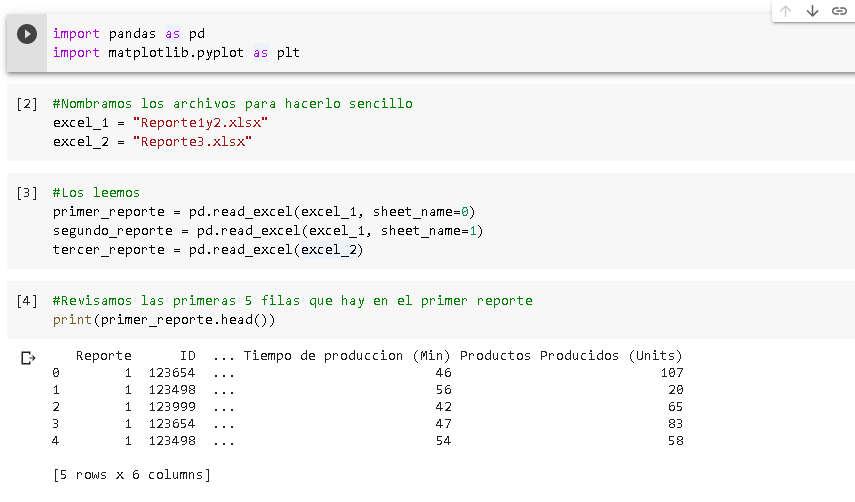
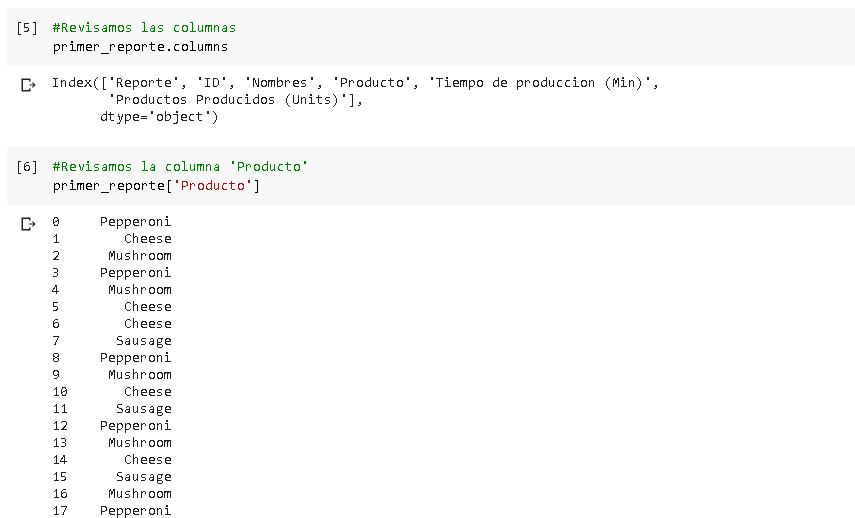
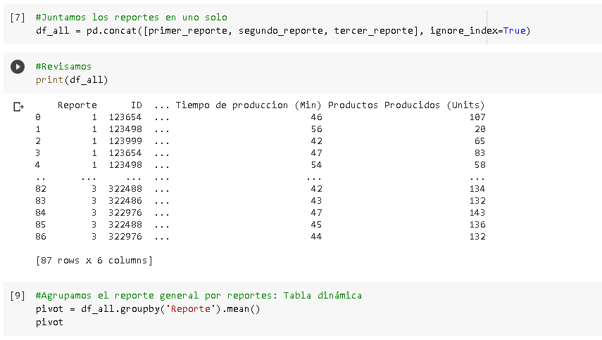
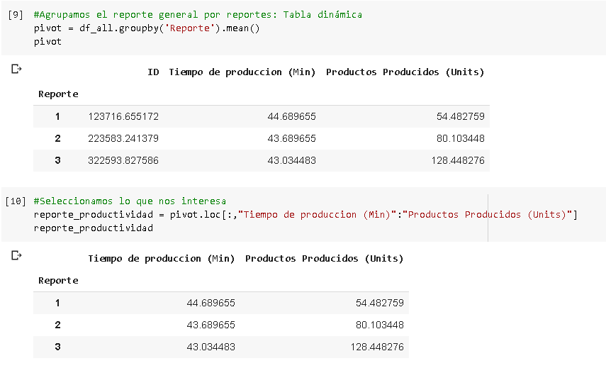
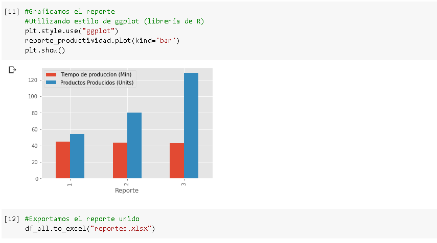

# Automatizando reportes con Python

> Cómo generar reportes con gráficos y tablas dinámicas en Python

Aquí veremos paso a paso cómo hacer un reporte de tablas dinámicas y gráficos en **Python** usando archivos **Excel**. Usaremos las librerías Pandas y Matplotlib dentro de Google Colab.

***

<h3 align="center"><strong>NOTE</strong></h3>

> Si lo haces fuera de Google Colab será necesario que importes las librerías xlrd y openpyxl para que no tengas dificultades a la hora de ejecutar el código

***
## Primer Paso
Primero lo que tenemos que hacer es importar los módulos, nombrar los archivos y asignarles algún nombre legible

## Segundo Paso 

Revisar las columnas que tenemos

## Tercer Paso 

Juntar los reportes en uno solo

## Cuarto paso 

Agrupamos el reporte general por reportes para así obtener una tabla dinámica y creamos el reporte de productividad\\
seleccionando lo que nos interesa

## Quinto paso

#### Graficamos el reporte de productividad y exportamos el reporte general

## Sobre nosotros 👋🏼

En [datahacks.ai](https://datahacks.ai/) brindamos formación y consultoría en temas de Data y Analytcis en Cloud. Nuestro equipo cuenta con profesionales certificados y amplia experiencia en diversas empresas. [**Encuentra nuestros cursos aquí!**](https://datahacks.ai)

## License 🗞

> Copyright © 2020 DataHack Formation — <hola@datahacks.ai>